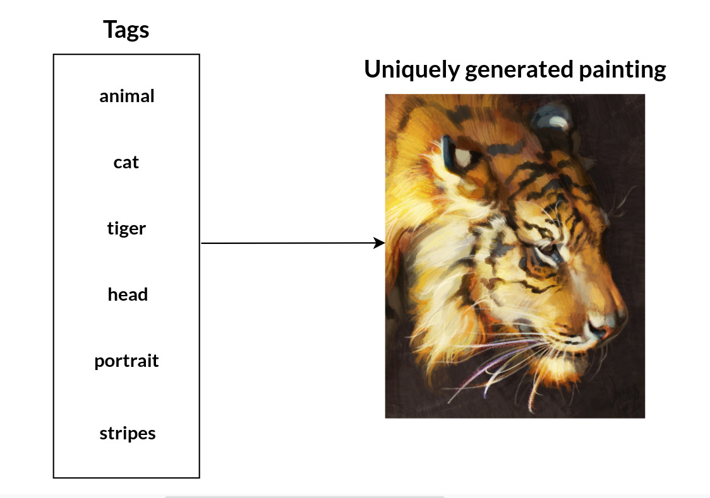
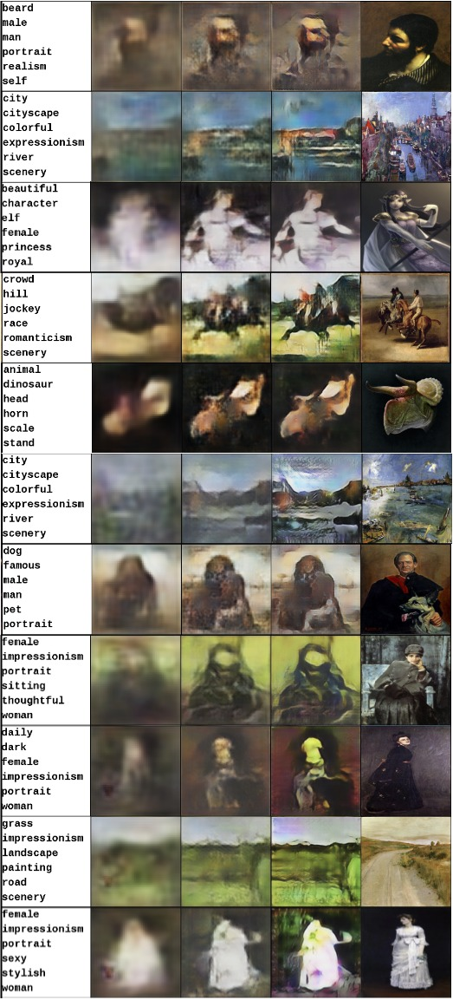
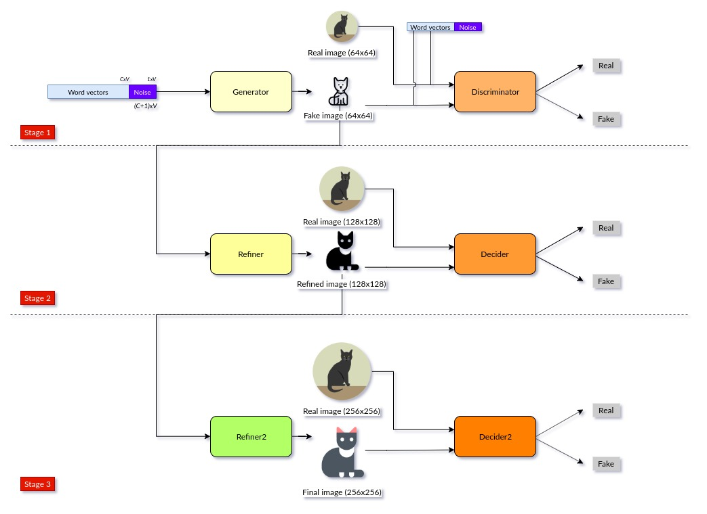
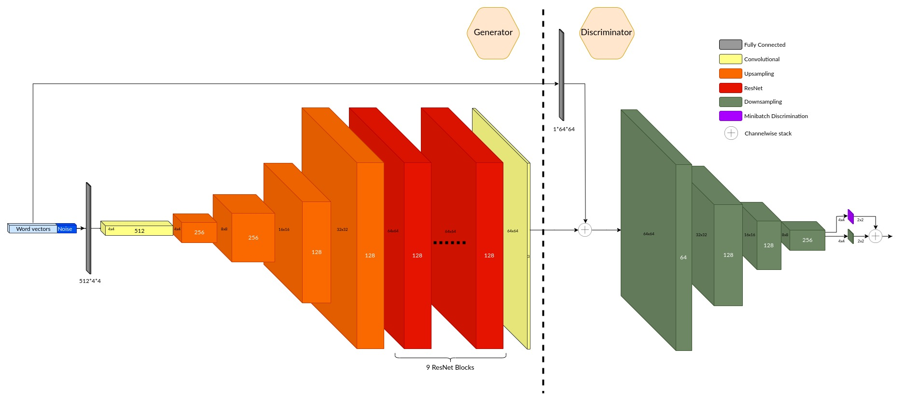
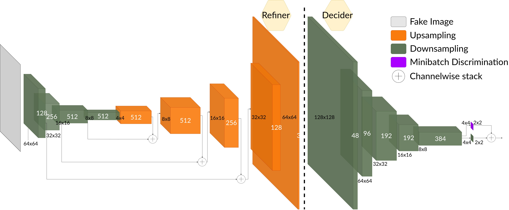
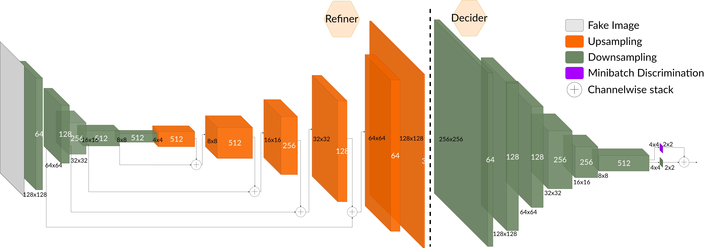
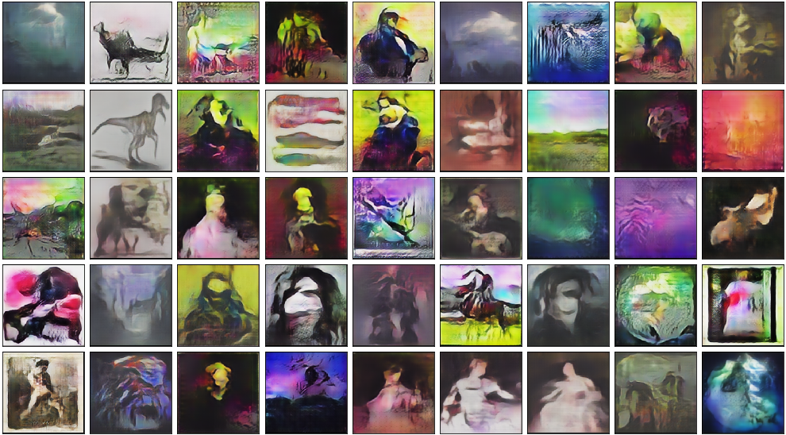

# text2painting

## Convert keywords into painting

Sample results (input words - stage1 output - stage2 output - stage3 output - ground truth)

## Model

Model is built as sequential GANs with three stages

## Stage-1 structure

## Stage-2 structure

## Stage-3 structure

## Installation

Set environment with

`conda env create -f environment.yml`

Install Spacy English language model

`python -m spacy download en`

## Gallery

## Data

You can download dataset from

A small sample of dataset can be downloaded from

https://drive.google.com/open?id=1KXEIrRGDvASEEm-vT_jJcvFLncapJDEL

Place them under `data/deviantart_verified/images` and `data/wikiart_verified/images`

## Model

There are models in the same link above as well

https://drive.google.com/open?id=1KXEIrRGDvASEEm-vT_jJcvFLncapJDEL

Place a model directory under `models/`

## Usage

All the necessary parameters are in `lib/config.py`

### Train

`python train.py`

Continue training with

`python train.py --model <model_file>`

### Test

`python test.py --model <model_file>`

### Prediction

`python pred.py --model <model_file> --input <input_text_file>`

Example input text file format is `asset/input.txt` with each keyword set in a newline.

## Citation

Please cite this paper

https://arxiv.org/abs/2007.04383