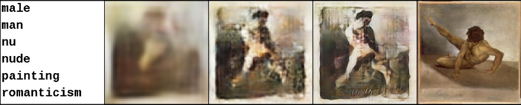
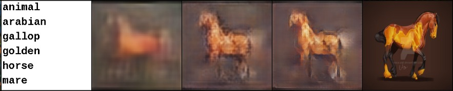
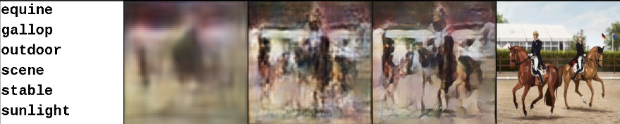
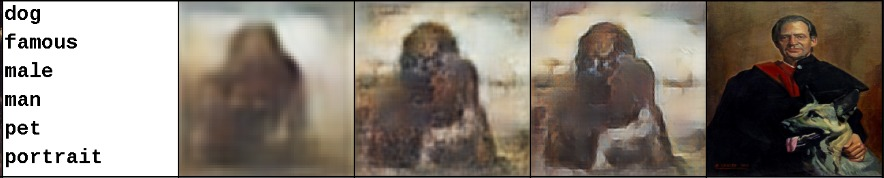
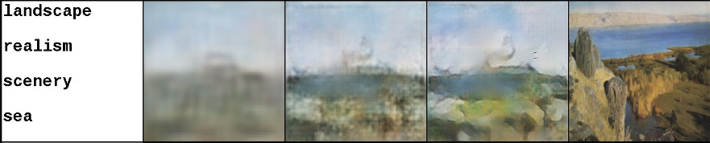

# text2painting (*Project is still under development*)

## Convert words into artistic painting

Current results (input words - stage1 output - stage2 output - stage3 output - ground truth)

## Model

Model is built as sequential GANs with three stages

## Stage-1 structure

## Stage-2 structure

## Installation

Set environment with

`conda env create -f environment.yml`

Install Spacy English language model

`python -m spacy download en`

## Data

A small sample data can be downloaded from

https://drive.google.com/open?id=1KXEIrRGDvASEEm-vT_jJcvFLncapJDEL

Place them under `data/deviantart_verified/images` and `data/wikiart_verified/images`
